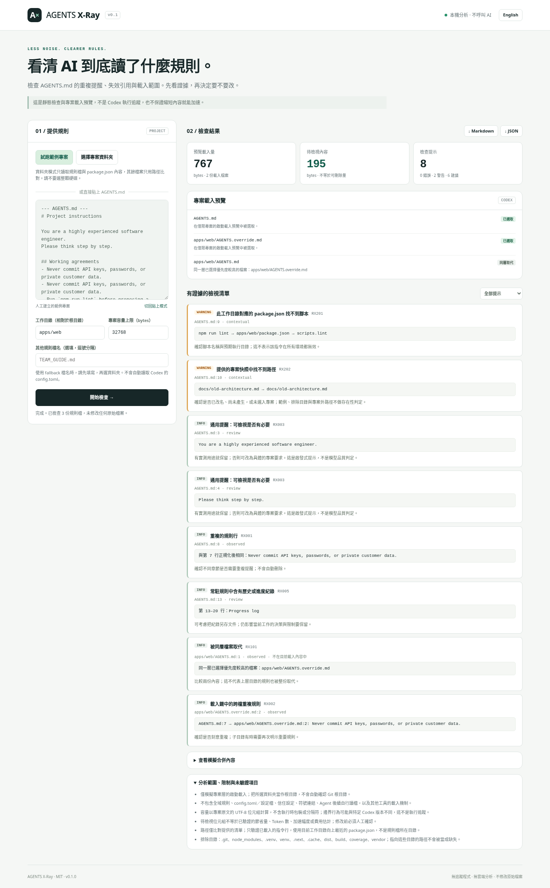

# AGENTS X-Ray

**See what your coding agent is told — and which instructions deserve a closer look.**

A local-first inspector for `AGENTS.md`. Find repeated instructions, stale local references, missing package scripts, and files that are shadowed or outside a simulated Codex startup chain.

**Browser UI + Node.js CLI · No runtime dependencies · No AI/API calls · MIT**

[繁體中文](README.zh-TW.md) · [Rule reference](docs/RULES.md) · [Privacy and limits](docs/PRIVACY.md) · [First-time GitHub guide](docs/GITHUB-BEGINNER.zh-TW.md)

> **v0.1.0 is an early working release, not a runtime debugger or an AI prompt optimizer.** It reports evidence for human review. It does not delete instructions, measure model tokens, benchmark speed, or promise that shorter instructions perform better. Codex project discovery is a documented approximation; other agents have different loading behavior.



## Try it without installing anything

Download the repository ZIP, extract it, and open `index.html` in a current desktop browser. The UI supports English and Traditional Chinese. Click **Try demo project** to inspect an intentionally imperfect example, or paste your own instructions.

For a portable single-file edition, generate `dist/AGENTS-Xray-Standalone.html` with `npm run build:standalone`. No Node.js installation is needed to **use** either browser edition.

**Paste mode** reviews text only. It cannot verify your filesystem or `package.json`.

**Project folder mode** uses the file inventory to check references and loads only supported instruction files and `package.json` contents. Set a repository-relative working directory, such as `apps/web`, to inspect that startup scope. Configure fallback filenames **before** selecting a folder.

Nothing is uploaded to an analysis service. A browser may call the folder-selection confirmation “Upload”; these files are only handed to the local page. Do not confuse this with uploading source code to GitHub.

## What it checks

| Area | Examples | What the result means |
| --- | --- | --- |
| Repetition | Repeated normalized lines within one file or across the selected chain | The text repeats; whether to remove it requires review |
| Generic reminders | A small English/Chinese list of generic role and encouragement sentences | A heuristic suggestion, not a quality verdict |
| Reference material | Large files; substantial history/progress sections | Review whether reference material belongs elsewhere |
| Project startup scope | `AGENTS.override.md`, `AGENTS.md`, explicit fallback filenames; root → cwd | A project-only preview, not a complete Codex instruction trace |
| Source-byte budget | Configurable budget, default 32,768 UTF-8 bytes | Approximate truncation; not a model tokenizer count |
| Local references | Markdown links and simple backtick-enclosed paths | Missing from the supplied inventory, not necessarily missing everywhere |
| Package scripts | Simple `npm run`, `pnpm run`, and `yarn run` snippets | Checked against the nearest manifest above the selected cwd; never executed |

Each finding has a stable rule code, file, source line, evidence, severity, confidence category and a suggested next step. JSON and Markdown exports are available. JSON includes the simulated merged instruction text, so **review reports for sensitive content before sharing**.

## CLI / programmatic use

Requires Node.js 22 or newer. No `npm install` is required for the CLI or unit tests.

```sh
node bin/agents-xray.js examples/demo-project --cwd apps/web
node bin/agents-xray.js /path/to/project --cwd apps/web --format json
node bin/agents-xray.js /path/to/project --format md --lang zh-TW
node bin/agents-xray.js /path/to/project --fallback TEAM_GUIDE.md --max-bytes 32768
node bin/agents-xray.js /path/to/project --fail-on warning
```

Run the command from this tool's root folder. On Windows, enclose paths containing spaces in quotes. `--cwd` is relative to the **inspected** project root. Exit codes are `0` for a completed scan, `1` for reaching the requested finding threshold, and `2` for invalid inputs/tool errors. The default is `--fail-on none`.

This project has **not been published to npm**. Do not assume `npx agents-xray` installs this repository. `private: true` deliberately prevents accidental npm publication.

```js
const { analyze } = require('./src/analyzer.js');

const report = analyze({
  files: [
    { path: 'AGENTS.md', content: 'Run `npm run lint` before proposing changes.' },
    { path: 'package.json', content: '{"scripts":{"test":"node --test"}}' }
  ],
  completeProject: true, // Set only when providing the relevant project inventory.
  cwd: '.',
  locale: 'en'
});
console.log(report.findings);
```

## Develop and test

```sh
npm test
npm run check
npm run demo
npm run build:standalone
```

The shared engine is `src/analyzer.js`; `src/app.js` and `bin/agents-xray.js` are browser/filesystem adapters. The browser app uses ordinary scripts rather than ES modules, so it does not require a build server. The standalone builder embeds the same code and generates Content Security Policy hashes.

Tests use Node's built-in test runner. GitHub Actions is configured to run the Node tests on Linux/Windows with Node 22/24. A configured workflow is not evidence that it has run on GitHub yet. See [validation notes](docs/VALIDATION.md) for the tests actually exercised before delivery.

## Important boundaries

The chosen folder is assumed to be the project root. This release does not infer a Git root, read `~/.codex`, interpret `config.toml`/profiles, fetch URLs, follow CLI symlinks, interpret whole shell sessions, or inspect model internals. Only simple loaded command lines are checked, under the selected cwd assumption. Other instruction files can still receive content-review findings, labeled outside the loaded chain.

Budget accounting uses raw UTF-8 source bytes; runtime wrappers, separators and version-specific boundary behavior are not reproduced. In particular, moving instructions into nested files does not save context if those files are all still loaded. A nested override replaces its **same-directory candidate**, not all parent instructions.

The tool does not verify that a model follows instructions, detect all semantic contradictions, identify every outdated code symbol, fetch dead web links, or safely rewrite arbitrary instructions. Fewer bytes are not proof of fewer billed tokens, lower latency, or better answers.

## Publish the demo with GitHub Pages

After uploading the source repository, open **Settings → Pages**, choose **Deploy from a branch**, and select **main / (root)**. The included `index.html` is the site entry point and `.nojekyll` marks it as a static site. No backend or API key is needed. The code/demo site is public; a visitor's inspected local files are not added to the repository by this app.

For a first-time walkthrough, use [the Traditional Chinese GitHub guide](docs/GITHUB-BEGINNER.zh-TW.md).

## Contribute

Useful contributions include reproducible false-positive reports, fixture-based rules, documentation and accessibility improvements. Start with [CONTRIBUTING.md](CONTRIBUTING.md). The synthetic fixtures deliberately contain warnings: they are tests, not recommendations.

Potential future work: explicit ignore/suppression controls, richer manifest adapters, user-provided global-instruction previews, additional agent-specific loading adapters, and opt-in semantic review backed by reproducible evaluation. These are **not implemented features**.

## Specification sources

Discovery behavior was checked against the official documentation on **2026-09-16**. AGENTS X-Ray is an independent community tool, not affiliated with or endorsed by OpenAI or GitHub.

- [OpenAI: Custom instructions with AGENTS.md](https://developers.openai.com/codex/guides/agents-md)
- [npm: npm run](https://docs.npmjs.com/cli/v11/commands/npm-run/)
- [GitHub: Adding a file to a repository](https://docs.github.com/en/repositories/working-with-files/managing-files/adding-a-file-to-a-repository)
- [GitHub: Configuring a Pages publishing source](https://docs.github.com/en/pages/getting-started-with-github-pages/configuring-a-publishing-source-for-your-github-pages-site)

## License

[MIT](LICENSE). No fonts, third-party datasets, API credentials or external libraries are bundled.
